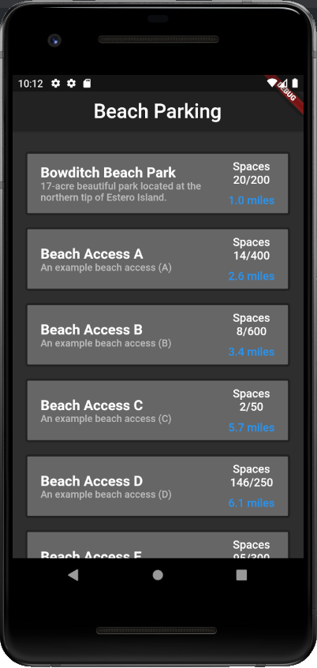
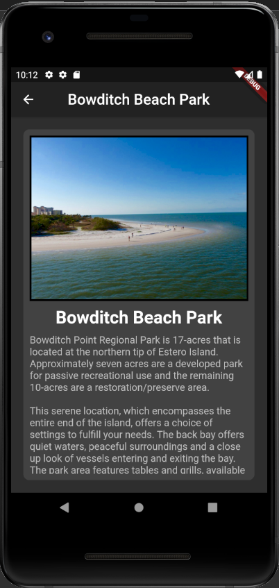

# Beach Parking Prototype
A prototype of the beach parking application being developed as a senior project at Florida Gulf Coast University. The prototype allows you to navigate through one real beach and a few mock beach information screens. The prototype was developed using flutter. The debug APK (listed as APP-DEBUG.apk) can be run on an android device if you have one, or an example of the program being run on an emulator can be seen as a gif below (note: compression makes it looks strange, images are a better visual representation of design). Unfortunately I could not test the iOS version due to not having an iPhone.

## Static Image

## Example GIF

## Software Requirements Specification
You can view the SRS containing the bulk of information regarding this project, its listed as Software Requirements Specification (SRS).pdf.
